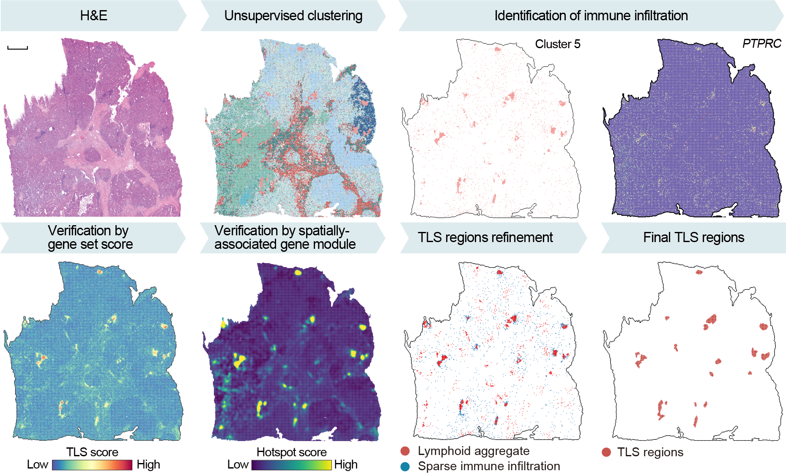

# TLS_Identification
To identify tertiary lymphoid structures (TLS) in spatial transcriptomics (ST) data, we developed a semi-automated pipeline with an interactive visualization and fine-tuning system that integrates the local density of immune cells, TLS-related gene signatures, co-expression modules, and hematoxylin and eosin (H&E) staining as multi-modal evidence to confirm the presence of each TLS. In [this notebook](./Data_for_TLS_identification.ipynb), we have presented the multi-modal data used for TLS identification

We established that a region was a TLS based on two criteria: a local immunocyte aggregate was recognized, and the majority of the signatures (i.e., two sets of gene signatures, co-expression modules, and H&E stains) supported the presence of the specific TLS. 

## Requirements
`pip install PySide2`

## Quick Start With Demo Data
`python main.py` 

## Prepare Input Data
1. H&E and ssDNA staining images after pairwise registration. 
>\*\_HE.tif
>\*\_ssDNA.tif
2. Coordinates of immune cells
>\*\_coor_TLS.csv
3. Coordinates of professional identification of TLSs from H&E staining image
>\*\_coor_bin50.csv
4. TLS-related spatial co-expression module, also show in `204.Hotspot_calculation.ipynb`; please choose the TLS-related module with spatial visualization of spatial transcriptomes
>\*\_hotspot.csv
5. Scores of the previously published TLS-50 signature (Wu, Sci Adv, 2021) and 12-Chmokine signature (Coppla, Am J Pathol, 2011), using Seurat's “AddModuleScore” function with default parameters. Also show in `205.AddModuleScore.ipynb`
>\*\_TLSmarkers_scores.csv
>\*\_chemokine_scores.csv

## Video 
You can manually adjust the threshold and export the results based on the data characteristics, just like in the following video.

https://github.com/Tang-Lab-super/ciTLSs/assets/40788743/2a5751bf-d53f-4eb6-b816-f858a26e4e83

## Results
The result file is a table, with all bins coordinates in TLSs, and labeled with TLS labels in the third column. You could merge these labels to metadata by your prefered programming language
`results.txt`
