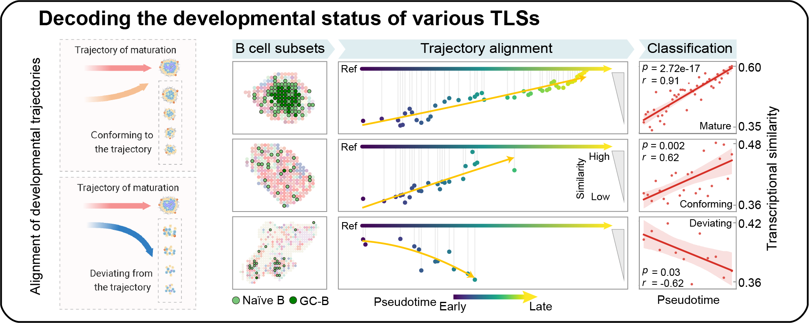

## TLS classification
We devised a novel classification schematic to categorize the canonical immature TLSs into **conforming** and **deviating** TLS groups based on their developmental trajectories in relation to the TLS maturation process.

In this folder, it is possible to access to the code used for TLS classfication.

1) Notebooks show how to construction the reference trajectory, which containing [Dimensional reduction](./1.Spring.ipynb) and [Pseudotime calculation](./2.Monocle3%20get%20pseudotime.ipynb)

2) Notebook for align NaiveB and GCB cells within immature TLS to the reference trajectory [3.TLS alignment.ipynb](./3.TLS%20alignment.ipynb)

3) Notebook for categorize the canonical immature TLS into **conforming** and **deviating** TLS groups based on their developmental trajectories in relation to the TLS maturation process [4.TLS classfication.ipynb](./4.TLS%20classfication.ipynb)
