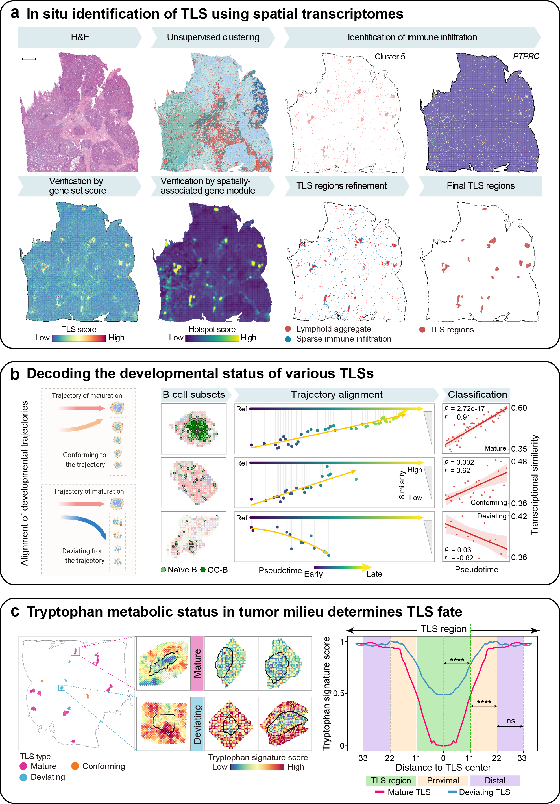

# ciTLS: Cross-modal Identification of Tertiary Lymphoid Structures

## Overview

&emsp;&emsp;Intratumor tertiary lymphoid structures (TLSs) are emergingly associated with immunotherapy efficacy and clinical outcomes. Mature TLSs within tumors are correlated with improved prognoses and enhanced responses to immunotherapy, whereas immature or absent TLSs are linked to poorer outcomes. 
&emsp;&emsp;Here, we develop a novel strategy **`ciTLS`** that enables comprehensively mapping TLSs in an ***in situ*** context and simultaneously deciphering their microenvironment using spatial transcriptomic profiles with a broad view of tissue at a **cellular resolution** generated by **Stereo-seq**.By implementing the strategy, we represent a comprehensive spatially resolved characterization of an unprecedented number of TLSs (461) from ten hepatocellular carcinoma (HCC) patients. 
&emsp;&emsp;Moreover, We devised a novel classification schematic to categorize the canonical immature TLSs into **conforming** and **deviating** TLS groups based on their developmental trajectories in relation to the TLS maturation process. Intriguingly, we discovered that the metabolic microenvironment shaped by malignant cells contributes to the heterogeneity of TLS maturation, with increased tryptophan metabolism driving the TLS deviation.  
&emsp;&emsp;Thus, our study not only provides a comprehensive overview of the dynamic molecular processes involved in TLS maturation, but also highlights the potential for combining interventions targeting tryptophan metabolism to enhance TLS maturation and improve immunotherapy outcomes.

In this repository it is possible to access to the code used in the analysis of Stereo-seq, snRNA-seq and sn-ATAC-seq of the associated manuscript.

1) Video and scripts for TLS identification using spatial transcriptomics are avaliable in [001.TLS_Identification](https://github.com/Tang-Lab-super/ciTLSs/tree/main/001.TLS_Identification)

2) Notebooks for how to classify different developmental stages of TLSs are avaliable in [002.TLS_Classification](https://github.com/Tang-Lab-super/ciTLSs/tree/main/002.TLS_Classification)

3) Notebooks for celltypes or subtypes annotation are available in [003.Celltype_Annotation](https://github.com/Tang-Lab-super/ciTLSs/tree/main/003.Celltype_Annotation)

4) Notebooks for all main figures are available in [004.Main_Figures](https://github.com/Tang-Lab-super/ciTLSs/tree/main/004.Main_Figures)

## Data access
All genomics data reported in this study have been deposited at the Genome Sequence Archive at the National Genomics Data Center (Beijing, China) under the BioProject ID PRJCA017662. The deposited and publicly available data comply with the regulations set forth by the Ministry of Science and Technology of China
## Contact
If you have questions about the data, please create a [new Issue](https://github.com/Tang-Lab-super/ciTLSs/issues/new)
